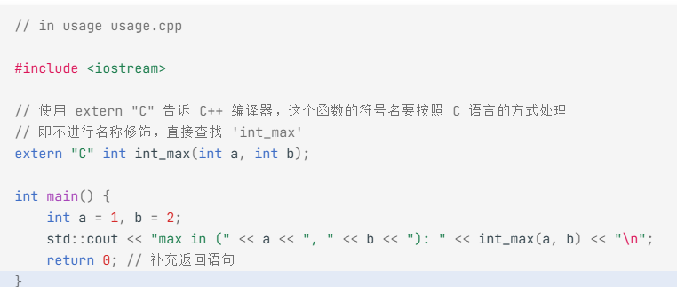

# 编译与链接导论

[← 返回 编译与链接MOC](编译与链接moc.md) | [← 进程、线程与任务](../../操作系统/进程、线程与任务.md) | [← 主页](../../../index.md)|[←内存管理](../../操作系统/内存管理.md)|

## 函数如何工作？

函数名转化为地址后 **call** (调用)，计算机处理流自动跳转到对应地址，取指令开始执行代码。

---

## 预处理，编译，链接，执行

### **预处理**

源代码向源代码的转换，比如 `#define` 展开和 `#if` 条件选择编译。

### **编译**

编写 C 语言无非是：**声明**和 **实现** 。

* **声明** ：告诉编译器：这里有个东西 (X)，是什么，值是多少？不知道。
* **实现** ：把声明和声明的实现关联起来，就是实现。
* 对于全局变量，实现是一个数据；对于函数，实现是我们可执行的代码。
* （实现）将会分配空间。

```
// demo.c
int un_g_initialized_var;
int g_initialized_var = 1;
extern int extern_var;
static int un_init_local_var;
static int init_local_var = 1;
static int local_func() {
 return 1;
}
int func() {
 return 2;
}
extern int extern_func();
int main() {
 return extern_var + extern_func();
}
```

#### 表1：文件级符号（全局 / 静态变量 & 函数）—— 决定"放在哪个段"

> 这些符号在**编译时就确定了存储位置**，对应进程地址空间中的 **正文段 (Text)**、**Data 段**、**BSS 段**。
>
> 未初始化就放BSS里,已初始化就放DaTa里

| 符号                     | 是什么                             | 谁可见（链接性）                   | 放在哪个段             | 说明                                                       |
| ------------------------ | ---------------------------------- | ---------------------------------- | ---------------------- | ---------------------------------------------------------- |
| `un_g_initialized_var` | 全局变量（未初始化）               | 外部 — 其他 `.o` 也能用         | **BSS**          | 不占可执行文件体积，加载时 OS 清零                         |
| `g_initialized_var`    | 全局变量（已初始化）               | 外部 — 其他 `.o` 也能用         | **Data**         | 初值写死在可执行文件里                                     |
| `extern_var`           | 变量**声明**（定义在别处）   | 外部 — 链接时去其他 `.o` 找     | **不占段**       | 纯声明，不分配空间；链接器负责把引用对号入座               |
| `un_init_local_var`    | 文件域 `static` 变量（未初始化） | **内部** — 仅本 `.o` 可见 | **BSS**          | 加了 `static` 的全局变量 = 隐藏符号，其他文件看不见      |
| `init_local_var`       | 文件域 `static` 变量（已初始化） | **内部** — 仅本 `.o` 可见 | **Data**         | 同上，已初始化                                             |
| `local_func`           | `static` 函数                    | **内部** — 仅本 `.o` 可见 | **Text** (.text) | 函数默认外部链接；加 `static` 后变成内部，其他文件调不到 |
| `func`                 | 普通函数                           | 外部 — 其他 `.o` 可调用         | **Text** (.text) | 函数的机器码                                               |
| `extern_func`          | 函数**声明**（定义在别处）   | 外部 — 链接时去其他 `.o` 找     | **不占段**       | 纯声明，不生成代码                                         |

#### 表2：函数内的局部变量 —— 运行时才出现

> 局部变量不属于"文件级符号"，**编译时不分配固定地址**。
>
> ⚠️ 函数内的 `static` 变量虽然作用域是局部的，但**存储位置跟全局变量一样在 BSS/Data**，不在栈上。

| 写法                            | 放在哪         | 说明                                                     |
| ------------------------------- | -------------- | -------------------------------------------------------- |
| `int a;`（函数内，非 static） | **栈**   | 自动存储期；未初始化则值是垃圾，函数返回后消失           |
| `static int b = 0;`（函数内） | **BSS**  | 作用域局限在函数内，但存储期是静态的——函数返回后值还在 |
| `static int c = 5;`（函数内） | **Data** | 同上，已初始化                                           |

#### 表3：堆 —— 手动申请，手动释放

| 写法                   | 放在哪       | 说明                                                       |
| ---------------------- | ------------ | ---------------------------------------------------------- |
| `malloc()` / `new` | **堆** | 运行时动态分配，生命周期由程序员控制，不归编译器和链接器管 |

---

---

### 编译器怎么编译

* 将 `C文件` **$\rightarrow$** `.o` 或 `.obj`
* **分为机器代码** ：0 和 1 组成的特定指令。
* **全局变量演化出的数据** ：C 文件中的全局变量。

只能一份一份的编译,文件之间的互相配合需要链接器

---

## 链接器

解决最小可执行文件（为什么是最小的呢？我们之后继续讨论）的符号未定义问题。任何那些 **你没提供对应信息告知定义的具体内容（那些用了的函数的源代码漏写）** 的链接都会失败！最后当链接器搜寻一圈后，只要存在未定义符号（也就是nm或者dumpbin中Class是U的符号），链接器就会拉起报错：告诉你所有那些没有定义的符号。 **这个时候你的解决方案非常简单——找到这些符号的可重定位文件（一般构建系统的源代码文件名和可重定位文件名相同，只有后缀不同），然后链接的时候提供！** 这是所有无动态库的编译场景下解决 `undefined reference`的 **唯一办法** 。

https://www.lurklurk.org/linkers/linkers.html

### 库和接口编程

#### 静态库:

我们可以早就准备好一系列的可重定位文件和一组符号的声明文件，然后我们编程的时候就不用重复造轮子了，直接在 编程的时候利用这些声明文件告知编译器我担保这些符号存在 ，编译的时候 通过编译生成咱们自己的可重定位文件 ，然后 链接的时候把这些早就准备好的可重定位文件和我们自己的重定位文件组合起来构成一个可执行文件.

我们以在微控制器上进行嵌入式开发为例，来看看这套流程是如何让你“偷懒”的：

假设你正在写一个水流发电的控制程序，你需要用到一个复杂的数学运算：求平方根 `sqrt()`。

1. **供应商的准备（造轮子）：**
   ARM 官方或者交叉编译工具链的开发者，早就写好了极其高效的求平方根的C代码 `sqrt.c`。他们把它编译成了 `sqrt.o`，并和其他数学函数（`sin.o`, `cos.o` 等）一起打包成了一个静态库文件： **`libm.a`** （Math Library）。同时，他们提供了一个包含所有这些数学函数声明的声明文件： **`math.h`** 。
2. **你的编码阶段（担保）：**
   你在你的 `main.c` 里写下了 `#include <math.h>`，然后直接调用了 `sqrt(4.0)`。
3. **你的编译阶段（生成自己的 `.o`）：**
   编译器处理 `main.c` 时，看到 `#include <math.h>` 里的声明，心想：“行，你担保了 `sqrt` 这个符号存在，我先放行。” 于是顺利编译出  **`main.o`** 。但在 `main.o` 内部，`sqrt` 的内存地址是空的。
4. **最终的链接阶段（组合）：**
   你敲下编译命令，链接器开始工作。它拿到你的  **`main.o`** ，发现缺少 `sqrt` 的具体实现。这时候，你告诉链接器：“去 **`libm.a`** 里找！”。链接器解开 `libm.a`，精准地把里面的 `sqrt.o` 揪出来，和你的 `main.o` 拼合在一起。最后生成了烧录到单片机里的可执行固件。

.a是打包(用归档管理器ar)后的.o,当代码中使用到相应的.o时,会从.a中检索出来对应的.o然后链接到程序里,但是.o里如果还是有只声明未找到定义的,要继续检索.a直到全部定义

#### 动态库/共享库:

MCU+RTOS几乎用不到,Linux里常用

如果链接器发现某个符号的定义存在于共享库中，它就不会在最终的可执行文件中包含该符号的定义。相反，链接器会在可执行文件中记录符号的名称以及它应该来自哪个库.

也就是可执行文件里缺少这部分定义,到时候去动态库里运行,可执行文件里只给个声明

还有一点,共享库会整个映射到地址中去

## C++的编译与链接

为了支持 **函数重载** 、 **命名空间** 、**类成员函数**等 C 语言没有的特性，C++ 编译器会对源代码中的函数名进行复杂的编码，这一过程称为**名称修饰（Name Mangling）**

但是静态库.a是由C编辑器编译.c生成的,C编辑器不进行名称修饰,

那么当编译好C++后,只声明未定义的变量从静态库中是找不到的,因为变量名被名称修饰了

使用**extern "C"**



## .h文件

1.有了.a但是怎么用呢,这里需要.h文件去使用

2.自己的项目把要用的文件声明都放到一个.H文件里,可以避免重复声明

有什么?:

* **函数声明** ：`void LED_Init(void);`（告诉编译器有这么个函数）。
* **宏定义和常量** ：`#define MAX_BUFFER_SIZE 1024`。
* **结构体和类型定义** ：`typedef struct { ... } GPIO_Config;`
