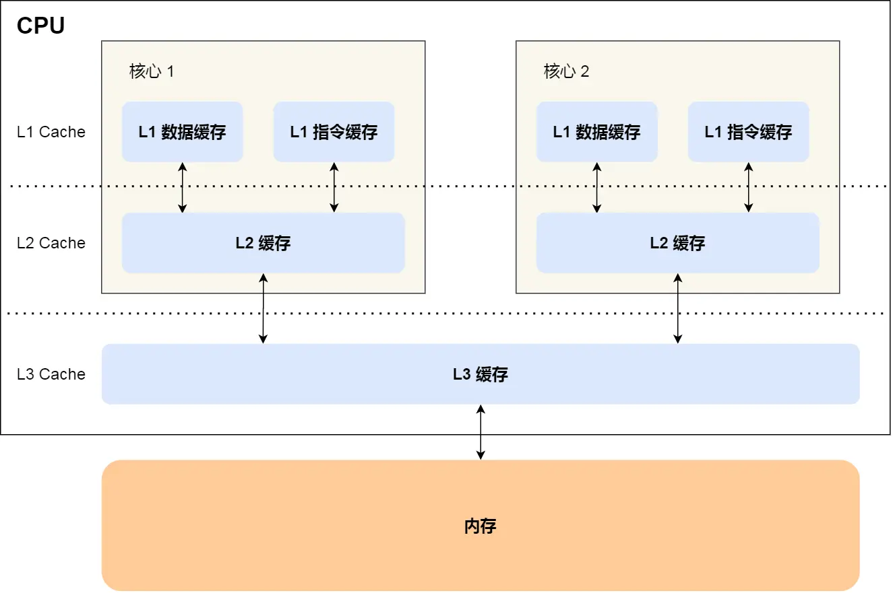
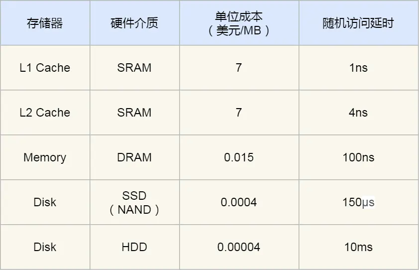

# CPU Cache

[← 存储器导航](./存储器.md) | [← 计算机组成原理知识地图](./MOC.md) | [← 主页](../../index.md)

## 为什么需要 Cache

CPU 比内存快得多。访问 L1 Cache 常常只要 `2~4` 个时钟周期，访问内存常常要 `200~300` 个时钟周期，所以 CPU 和内存之间必须加一层更快但更小的缓存。

Cache 通常基于 SRAM，速度快，但贵而且容量小，所以只能做成 L1、L2、L3 这种多级小缓存。

其中有 3 个基础点要直接记住：

- L1 Cache 通常分成**数据缓存**和**指令缓存**
- L1、L2 通常是**每个 CPU 核心独有**
- L3 通常是**多个 CPU 核心共享**

程序执行时，数据一般按 `内存 -> L3 -> L2 -> L1 -> CPU` 这条路径逐级靠近核心。

## Cache Line

Cache 不是按单个变量管理数据，而是按 **Cache Line** 成块管理。常见一条 Cache Line 是 `64` 字节。

这意味着 CPU 访问一个地址时，通常会把它附近一整块数据一起搬进 Cache，而不是只搬当前这一个字节。

## 地址怎么在 Cache 里找数据

内存地址通常拆成三部分：

- `Tag`：判断这一行是不是目标内存块
- `Index`：定位候选 Cache Line
- `Offset`：在这一行内部取具体数据

每条 Cache Line 里除了数据，还至少有：

- `Tag`
- `Valid bit`

CPU 读数据时流程很简单：

1. 用 `Index` 找到候选 Cache Line
2. 检查 `Valid bit`
3. 比较地址里的 `Tag`
4. 命中后再用 `Offset` 取出目标数据

`Valid` 或 `Tag` 任一不对，就是 `miss`，CPU 需要去更低层取数据。

## 直接映射和冲突

最容易理解的方式是 **直接映射**：一个内存块只能映射到唯一一条 Cache Line。

这样查找快，但会有冲突。比如多个内存块都映射到同一条 Cache Line 时，后来的数据会把前面的顶掉，所以即使 Cache 还有别的位置，也可能反复 miss。

另外两种常见方式可以先知道名字：

- **全相连**：可放任意行，最灵活
- **组相连**：只能进指定组，但组内可放任意行

本质都是在平衡两件事：**查找速度** 和 **冲突概率**。

## 为什么顺序访问更快

因为 Cache 按 Cache Line 成块加载，访问一个元素时，附近的数据往往已经一起进来了。

所以连续访问数组时，后续元素更容易直接命中同一条 Cache Line；跳着访问时，更容易不断 miss。

这背后就是两个核心规律：

- **时间局部性**：刚访问过的数据，短时间内还可能再访问
- **空间局部性**：刚访问过的地址附近，接下来也很可能被访问

对**计算密集型线程**来说，还有一条很实用的工程经验：如果线程频繁在不同 CPU 核心之间切换，会更容易破坏原来的缓存命中状态；把线程尽量绑定在固定核心上，通常更有利于维持缓存命中率。

如果接下来关心的是“多个核心都有各自 Cache 时，为什么不会把数据写乱”，继续看 [缓存一致性与MESI](./缓存一致性与MESI.md)。

## 继续看

- [缓存一致性与MESI](./缓存一致性与MESI.md)
- [内存](./内存.md)
- [存储器层次结构](./存储器层次结构.md)
- [存储器价格与性能差距](./存储器价格与性能差距.md)

---

参考主线：小林coding《[2.3 如何写出让 CPU 跑得更快的代码？](https://xiaolincoding.com/os/1_hardware/how_to_make_cpu_run_faster.html)》
