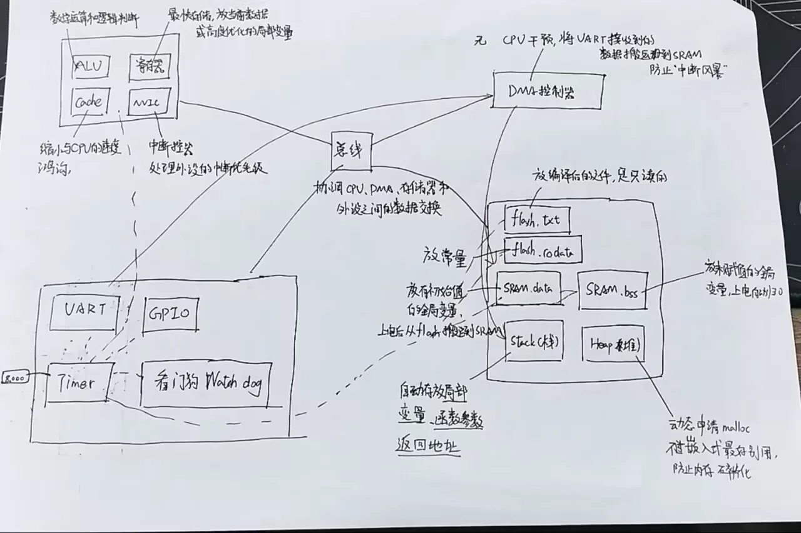

# 计算机组成原理 — 知识地图

[← 学科总览](../MOC.md) | [← 主页](../../index.md)

> 状态：⏳ 学习中
>
> 

## 🔗 当前进度

这部分还在学习中，暂时不整理完整“学习主线”。

现阶段先按已完成笔记逐步补知识点，后面等主要章节学完，再统一回头整理主线。

---

## 核心章节

### 🔴整体结构与基本概念

[计算机组成](计算机组成.md)

### 🔴数据表示与数值运算

[存储浮点数](存储浮点数.md)

[上溢与下溢](上溢与下溢.md)

[位、字节与字](位、字节与字.md)

### 🔴存储器

[存储器](存储器.md)

### 🔴指令系统

待补充

### 🔴CPU

待补充

### 🔴总线与 I/O

待补充

---

## 高频考点

| 题目 | 难度 | 备注 |
| --- | --- | --- |
| IEEE 754 单精度和双精度的存储结构分别是什么？ | 中等 | 浮点数表示 |
| 为什么浮点数的指数使用偏置表示，而不是直接用补码？ | 中等 | 浮点数表示 |
| 什么是整数上溢和下溢？无符号数与补码溢出的判断方法有什么区别？ | 中等 | 整数运算 |
| 浮点数上溢和下溢分别会导致什么结果？ | 中等 | 浮点运算 |
| 寄存器、CPU Cache、内存、硬盘在速度、容量、价格上分别有什么规律？ | 中等 | 存储器 |
| 为什么 CPU 不直接从硬盘取数据？为什么要设计多级缓存？ | 中等 | 存储器 |

## 错题 / 难点

- 浮点数的“真实指数”和“存储指数”容易混淆。
- 无符号整数的借位/进位标志，与有符号补码的溢出标志不是同一个概念。
- 存储器层次结构里，“离 CPU 更近”通常同时意味着更快、更小、更贵。
