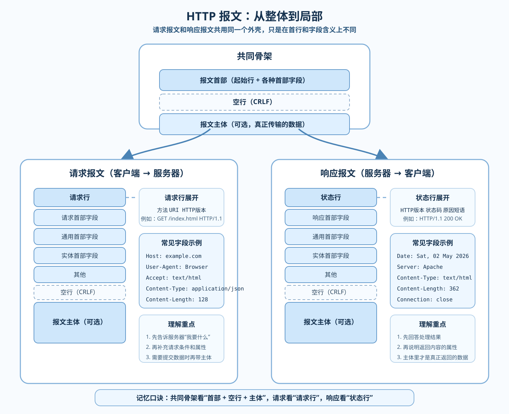

# HTTP报文

[← 返回 MOC](MOC.md) | [← 主页](../../index.md) | [← 返回HTTP万维网](HTTP万维网.md)

---

## 整体结构

HTTP 请求报文和响应报文都可以先看成同一个骨架：`报文首部 + 空行(CRLF) + 报文主体`。它们真正的区别，主要出现在首部中的第一行，请求报文是**请求行**，响应报文是**状态行**。

## 请求报文

- 请求行格式：`方法 URI HTTP版本`
- 常见方法：`GET`、`POST`、`PUT`、`DELETE`

## 响应报文

- 状态行格式：`HTTP版本 状态码 原因短语`
- 状态码速查见 [HTTP状态码](HTTP状态码.md)

## 报文首部

首部字段分为通用首部、请求首部、响应首部、实体首部四类，详见 [HTTP报文首部](HTTP报文首部.md)。

---

如果你正在跟随梳理, 返回 [MOC←](MOC.md)
