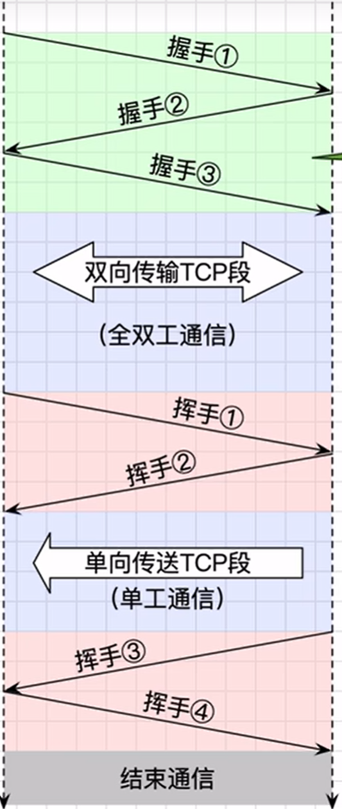
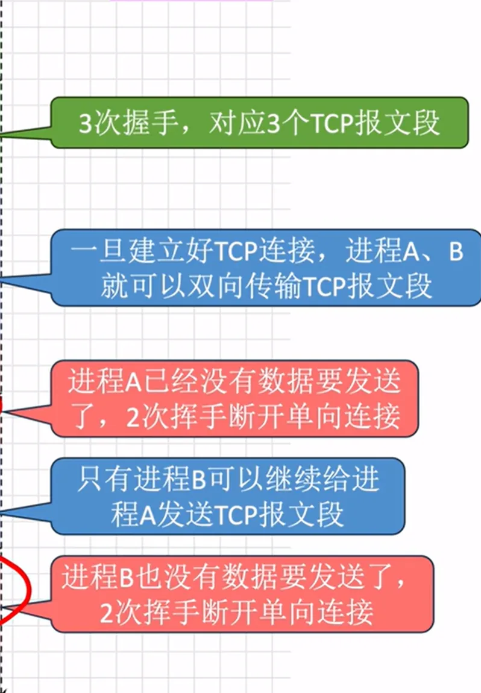

# TCP连接管理

[← 返回 TCP](TCP协议.md) | [← 返回 MOC](MOC.md)

---



TCP 是面向连接的，通信前必须先建连接，通信后必须断连接。

## 三次握手

为什么要握手？双方都要确认自己能发、对方能收，两次握手只能确认一边，三次才能确认两边。

```
客户端                    服务端
  |  ── SYN ──────────→  |   第1次：我想连，我的序号是 x
  |  ←──── SYN+ACK ───  |   第2次：收到，我的序号是 y，确认你的 x+1
  |  ── ACK ──────────→  |   第3次：收到，确认你的 y+1
  |        连接建立        |
```

第三次握手的必要性：网络有延迟，如果客户端早期发的一个失效的 SYN 后来才到达服务端，服务端以为是新请求就回了 SYN+ACK，没有第三次握手服务端就会傻等，白白占用资源。

## 四次挥手

为什么挥手比握手多一次？因为 TCP 是全双工的，两个方向的数据流要分别关闭。

```
客户端                    服务端
  |  ── FIN ──────────→  |   第1次：我发完了，想断
  |  ←──── ACK ────────  |   第2次：收到，但我可能还有数据没发完
  |  ←──── FIN ────────  |   第3次：我也发完了
  |  ── ACK ──────────→  |   第4次：收到，连接关闭
```

中间那段等待就是为什么挥手比握手多一次——服务端收到 FIN 后可能还有数据要发，不能立刻关。

## TIME_WAIT

客户端发完最后一个 ACK 后，不会立刻关闭，而是等待 **2MSL**（MSL = 报文最大生存时间）。

两个原因：

1. 最后那个 ACK 可能丢了，服务端会重发 FIN，客户端要能接到并重新回 ACK
2. 让网络中残留的旧报文段彻底消失——TCP 连接由四元组（源IP + 源端口 + 目的IP + 目的端口）标识，如果刚关闭就用同样的四元组建新连接，网络里还飘着上一次的旧包，会混进新连接导致数据错乱。等 2MSL 就是等这些旧包全部过期。MSL 是报文在网络中能存活的最大时间，一来一回最多 2MSL。

---

如果你正在跟随梳理, 返回 [TCP←](TCP协议.md)
