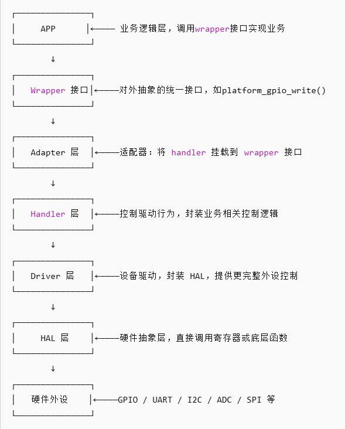

# 软件架构 MOC

[← 返回库总览](../MOC.md)

## 笔记入口

| 技术名         | 笔记                        |
| -------------- | --------------------------- |
| FreeRTOS       | [freeRTOS 笔记](./freeRTOS/MOC.md) |
| 表驱法         | [表驱法 笔记](./表驱法.md)     |
| 小项目软件架构 | [小项目架构](小项目架构.md)    |

## 联动学习

- 学 `FreeRTOS` 时，建议同时打开 [操作系统知识地图](../../书中自有黄金屋/操作系统/MOC.md) 对照看。
